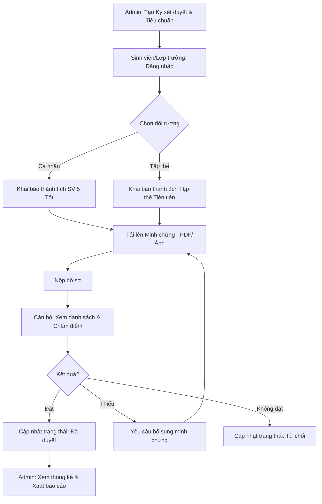
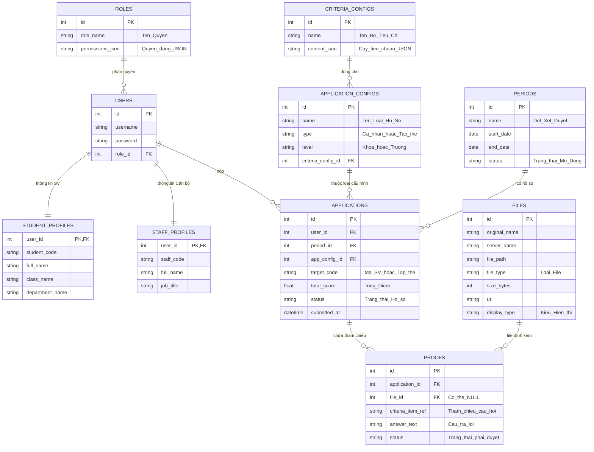

# 🏗️ Thiết kế Hệ thống & Cơ sở dữ liệu (ERD)

Tài liệu này mô tả luồng xử lý nghiệp vụ, sơ đồ quan hệ các bảng (ERD) và mã SQL khởi tạo cho dự án Scholastic Kinetic.

---

## 1. 🔄 Luồng xử lý chính (Workflow)



---

## 2. 🗄️ Sơ đồ Quan hệ Thực thể (ERD)



---

## 3. 📜 SQL Script cho Supabase (PostgreSQL)

Dưới đây là mã SQL khởi tạo cho Supabase, bao gồm các bảng, ràng buộc và dữ liệu mẫu:

```sql
-- 1. Khoa & Lớp học
CREATE TABLE khoa (
    id SERIAL PRIMARY KEY,
    ma_khoa VARCHAR(20) UNIQUE NOT NULL,
    ten_khoa VARCHAR(200) NOT NULL
);

CREATE TABLE lop_hoc (
    id SERIAL PRIMARY KEY,
    ma_lop VARCHAR(20) UNIQUE NOT NULL,
    ten_lop VARCHAR(100) NOT NULL,
    khoa_id INT REFERENCES khoa(id)
);

-- 2. Người dùng & Hồ sơ
CREATE TABLE users (
    id SERIAL PRIMARY KEY,
    ho_ten VARCHAR(100) NOT NULL,
    email VARCHAR(100) UNIQUE NOT NULL,
    password_hash VARCHAR(255) NOT NULL,
    ma_sv VARCHAR(20) UNIQUE,
    role VARCHAR(20) CHECK (role IN ('student','monitor','reviewer','admin')),
    lop_id INT REFERENCES lop_hoc(id)
);

-- 3. Kỳ xét duyệt & Tiêu chí
CREATE TABLE ky_xet_duyet (
    id SERIAL PRIMARY KEY,
    ten_ky VARCHAR(200) NOT NULL,
    loai VARCHAR(20) CHECK (loai IN ('hk1','hk2','ca_nam')),
    trang_thai VARCHAR(20) CHECK (trang_thai IN ('upcoming','active','closed'))
);

CREATE TABLE tieu_chi (
    id SERIAL PRIMARY KEY,
    ten_tieu_chi VARCHAR(200) NOT NULL,
    loai_doi_tuong VARCHAR(20) CHECK (loai_doi_tuong IN ('individual','collective','both')),
    thu_tu INT DEFAULT 0
);

-- 4. Hồ sơ & Minh chứng
CREATE TABLE ho_so (
    id SERIAL PRIMARY KEY,
    ma_ho_so VARCHAR(20) UNIQUE NOT NULL,
    sinh_vien_id INT REFERENCES users(id),
    ky_xet_duyet_id INT REFERENCES ky_xet_duyet(id),
    trang_thai VARCHAR(20) DEFAULT 'draft'
);

CREATE TABLE minh_chung (
    id SERIAL PRIMARY KEY,
    ho_so_id INT REFERENCES ho_so(id) ON DELETE CASCADE,
    tieu_chi_id INT REFERENCES tieu_chi(id),
    ten_thanh_tich TEXT NOT NULL,
    file_url TEXT -- Đường dẫn file lưu trên Supabase Storage
);
```

---

## 4. 📁 Lưu trữ File (Supabase Storage)

- **Bucket**: `minh-chung`
- **Quy tắc**:
  - File được tổ chức theo cấu trúc: `ho-so/{ho_so_id}/{timestamp}_{filename}`
  - Truy cập thông qua **Signed Upload URL** để đảm bảo bảo mật.
  - File công khai (Public URL) chỉ cấp cho các hồ sơ đã được duyệt hoặc đang trong quá trình xét duyệt.

---

## 4. 🛠️ Công cụ đề xuất

1.  **Xem Sơ đồ (Mermaid)**:
    *   Sử dụng **VS Code** và cài Extension: **"Markdown Preview Mermaid Support"**.
    *   Hoặc dán code vào [Mermaid Live Editor](https://mermaid.live/).

2.  **Quản lý Cơ sở dữ liệu**:
    *   **MySQL Workbench**: Vẽ ERD tự động từ Database và chạy SQL.
    *   **DBeaver**: Giao diện đẹp, dễ dùng cho người mới.

3.  **Vẽ quy trình (Workflow)**:
    *   **Draw.io (diagrams.net)**: Miễn phí và cực kỳ chuyên nghiệp.
